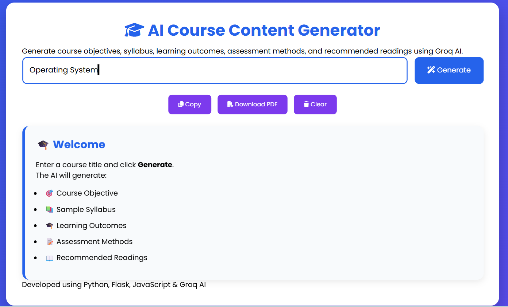
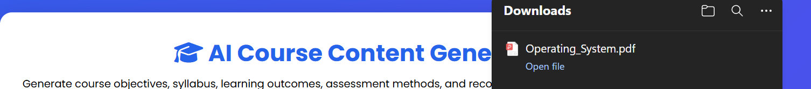

# 🎓 AI Course Content Generator

An AI-powered web application that dynamically generates educational course content from a given course title using the **Groq API**. The application is built with **Python(Flask)** for the backend and **HTML,CSS,and JavaScript** for the frontend.


---
# 📖 Project Overview

The **AI Course Content Generator** is a web-based AI application that automatically creates structured educational course content from a course title entered by the user.

Using the **Groq API**, the application generates:

* 🎯 Course Objective
* 📚 Sample Syllabus
* 🎓 Three Learning Outcomes aligned with Bloom's Taxonomy
* 📝 Assessment Methods
* 📖 Recommended Readings

The generated content is displayed in a clean, user-friendly interface and can be copied or downloaded as a PDF.
---

# ✨ Features

* 🤖 AI-powered educational content generation
* 📘 Generates complete course structure
* 🎯 Bloom's Taxonomy-based learning outcomes
* 📚 Dynamic syllabus generation
* 📝 Assessment methods with weightage
* 📖 Recommended books and references
* 📋 Copy generated content
* 📄 Download as PDF
* 📱 Responsive user interface
* ⚠️ Error handling
* 🔒 Secure API key using `.env`

---
# 🛠️ Technologies Used

## Backend
* Python
* Flask
* Groq API
* python-dotenv

## Frontend
* HTML5
* CSS3
* JavaScript

## Libraries
* html2pdf.js
* Font Awesome

---
# 📂 Project Structure
```text
AI-Course-Content-Generator/
│
├── main.py
├── requirements.txt
├── README.md
├── .env.example
├── .gitignore
│
├── templates/
│   └── index.html
│
├── static/
│   ├── style.css
│   └── script.js
│
└── screenshots/
    ├── home.png
    ├── input.png
    ├── loading.png
    ├── generated.png
    └── pdf.png
```
---
# 🚀 Installation
### 1. Clone the repository
```bash
git clone https://github.com/PalakD42/AI-Course-Content-Generator.git
```
### 2. Open the project folder
```bash
cd AI-Course-Content-Generator
```
### 3. Create a virtual environment
```bash
python -m venv venv
```
### 4. Activate the virtual environment
**Windows**
```bash
venv\Scripts\activate
```
### 5. Install dependencies
```bash
pip install -r requirements.txt
```
### 6. Create a `.env` file
```env
GROQ_API_KEY=YOUR_GROQ_API_KEY
```
### 7. Run the application

```bash
python main.py
```
### 8. Open your browser
```
http://127.0.0.1:5000
```
---

# 💻 How It Works
1. User enters a course title.
2. The frontend sends the request to the Flask backend.
3. Flask forwards the prompt to the Groq API.
4. The AI generates structured educational content.
5. The generated content is displayed on the webpage.
6. Users can copy or download the generated content as a PDF.
---

# 📷 Screenshots
## 🏠 Home Page


---
## ✍️ Enter Course Title


---
## ⏳ Generating Content


---

## 📄 Generated Course Content


---

## 📄 Download PDF


---

# 📚 Example
### Input
```
Operating System
```
### Output

* Course Objective
* Five-module syllabus
* Learning Outcomes
* Assessment Methods
* Recommended Readings

---
# 🔒 Data Privacy
* API keys are securely stored using a `.env` file.
* No user data is permanently stored.
* User input is used only for AI-based course generation.
---

# 🌱 Future Enhancements
* 🌙 Dark Mode
* 👤 User Authentication
* 🗂️ Course History
* 📄 Export to Microsoft Word
* 📊 Export to Excel
* 🌍 Multi-language Support
* 🗄️ Database Integration
* 🤖 Support for multiple AI models
---

# 📋 Requirements
* Python 3.10 or above
* Flask
* Groq API Key
* Internet connection
---

# 👨‍💻 Author
**Name:** Palak Dwivedi
**Role:** Engineering Student

---

# 📜 License

This project is developed for educational purposes.
Licensed under the MIT License.
